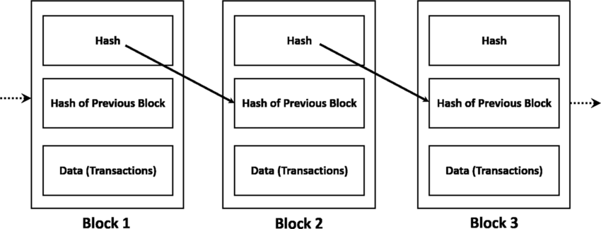
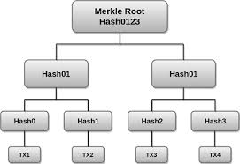

# SimpleBlockChain


This project is a basic blockchain implementation in **C**, using **SHA-256** hashing (via OpenSSL) and a **Merkle Tree** for transaction integrity.



## Features
- Create blocks containing transactions.
- Build a Merkle Tree to compute a Merkle Root.
- Link blocks together with hashes.
- Simple transaction management (up to 10 per block).
- Basic blockchain structure with dynamic memory allocation.
- **Genesis Block** creation (first block of the chain).

## How it Works
- When the blockchain starts, it automatically creates a **Genesis Block** with a special transaction called `"Genesis Block"`.
- New transactions are added to the **most recent block** until you manually create a new block.
- Transactions are grouped, hashed into a Merkle Tree, and the Merkle Root is used in the block hash for data integrity.
- Blocks are linked together using their hashes, forming a simple blockchain.

### Example
```
1. Start the program.
2. Add a transaction (e.g., "Yasmine sends to Aicha 100 da").
3. The transaction will be added to the current block (initially the Genesis Block).
4. To create a new block, type 'newblock'.
5. 'exit' will stop the program and print the blockchain.
```

## Requirements
- C compiler (gcc, clang, etc.)
- OpenSSL library

## How to Compile
```bash
gcc blockchain.c -o blockchain -lssl -lcrypto
```

## How to Run
```bash
./blockchain
```

## Notes
- This project is for educational purposes.
- No real Proof of Work or networking is implemented.
- Memory freeing for Merkle trees (`free_merkle_tree`) is mentioned but not yet coded.
