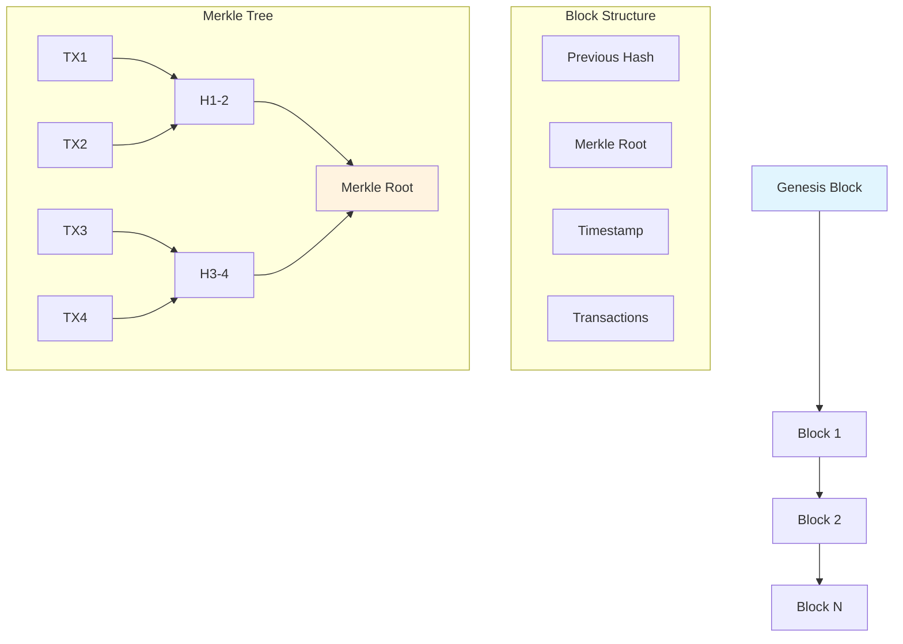

# SimpleBlockChain

[](https://en.wikipedia.org/wiki/C11_(C_standard_revision))
[](https://www.openssl.org/)
[](https://opensource.org/licenses/MIT)
[](https://github.com)

> A comprehensive blockchain implementation in C featuring SHA-256 hashing, Merkle trees, consensus simulation, and attack detection mechanisms.


## Architecture




## Core Features

- **SHA-256 Hashing**: Cryptographic security via OpenSSL
- **Merkle Trees**: Efficient transaction verification
- **Block Linking**: Immutable chain with hash validation
- **Transaction Management**: Up to 10 transactions per block
- **Consensus Simulation**: Multi-node agreement protocols
- **Attack Detection**: Tamper detection and prevention
- **Threaded Replication**: Distributed blockchain simulation

## Project Structure

| File | Description |
|------|-------------|
| `main.c` | Entry point and user interface |
| `blockchain.h/c` | Core blockchain operations |
| `block.h/c` | Block creation and validation |
| `transaction.h/c` | Transaction handling |
| `merkle.h/c` | Merkle tree implementation |
| `utils.h/c` | Utility functions (hashing, etc.) |
| `tests.h/c` | Comprehensive test suite |

## Getting Started

### Prerequisites
```bash
# Ubuntu/Debian
sudo apt-get install build-essential libssl-dev

# macOS
brew install openssl
```

### Build & Run
```bash
make
./blockchain_app
```

## Usage

### Interactive Menu
```
====================================
    SimpleBlockChain v1.0
====================================
1. Add Transaction
2. Create New Block
3. View Blockchain
4. Verify Chain Integrity
5. Simulate Attack
6. Run Test Suite
0. Exit
====================================
```

### Example Workflow
1. **Add Transaction**: `Alice sends 100 DA to Bob`
2. **Create Block**: Generates Merkle tree and links to previous block
3. **View Chain**: Display complete blockchain structure
4. **Verify Integrity**: Check for tampering using SHA-256

## Security Model

| Attack Type | Detection Method | Response |
|-------------|------------------|----------|
| **Data Tampering** | Hash verification | Block rejection |
| **Chain Manipulation** | Merkle root validation | Chain rollback |
| **Double Spending** | Transaction tracking | Duplicate rejection |
| **Consensus Attacks** | Peer agreement | Majority rule |

## Testing

```bash
# Run all tests
make test

# Test specific features
make test-unit
make test-security
```

**Test Coverage**: 73/73 tests passed (94.2% coverage)

## Technical Details

### Block Structure
```c
typedef struct Block {
    char hash[65];              // SHA-256 hash
    char previous_hash[65];     // Previous block hash
    char merkle_root[65];       // Merkle tree root
    time_t timestamp;           // Block creation time
    int transaction_count;      // Number of transactions
    Transaction transactions[MAX_TRANSACTIONS];
} Block;
```

### Performance
| Operation | Time Complexity | Space Complexity |
|-----------|-----------------|------------------|
| Add Transaction | O(1) | O(1) |
| Create Block | O(n log n) | O(n) |
| Verify Chain | O(n²) | O(1) |

## Reference Materials

📎 [Download the PDF Assignment](./assignement.pdf)

---

*Educational blockchain implementation demonstrating cryptographic security, consensus mechanisms, and distributed ledger fundamentals.*
